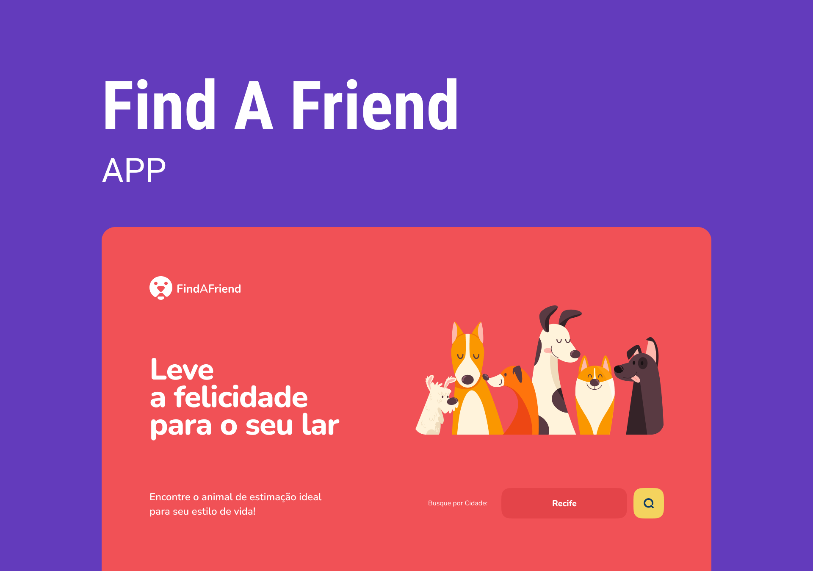

<h1 align="center">FindAFriend</h1>

  FindAFriend is a project that aims to facilitate the adoption of animals, connecting people interested in adopting with animals available for adoption. The platform offers an easy and intuitive way to find a new furry friend to join your family.

  <a href="#-links">Links</a>&nbsp;&nbsp;|&nbsp;&nbsp;
  <a href="#-versioning">Versioning</a>&nbsp;&nbsp;|&nbsp;&nbsp;
  <a href="#memo-license">License</a>

  

  

## 📎 Links

- API: <a href="server">README.md</a>
- Deploy API on [Render](https://render.com/): https://find-a-friend-api-srvo.onrender.com/
- Repository: https://github.com/DevPedroHB/find-a-friend

## 🔰 Versioning

Here are the versions of the parts of the project.

- API -> 1.0.0

## :memo: License

This project is licensed under the MIT license.

---

Made with ♥ by Pedro Henrique 🚀 [Never stop learning!](https://github.com/DevPedroHB)
